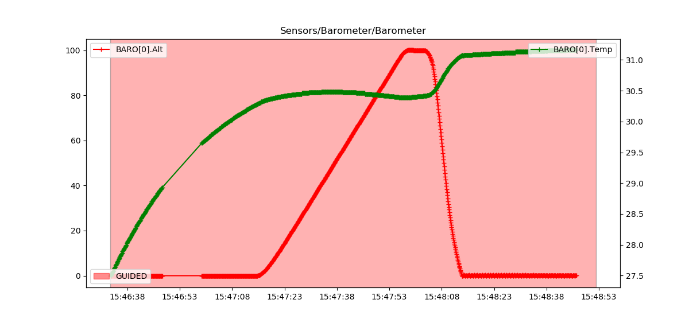
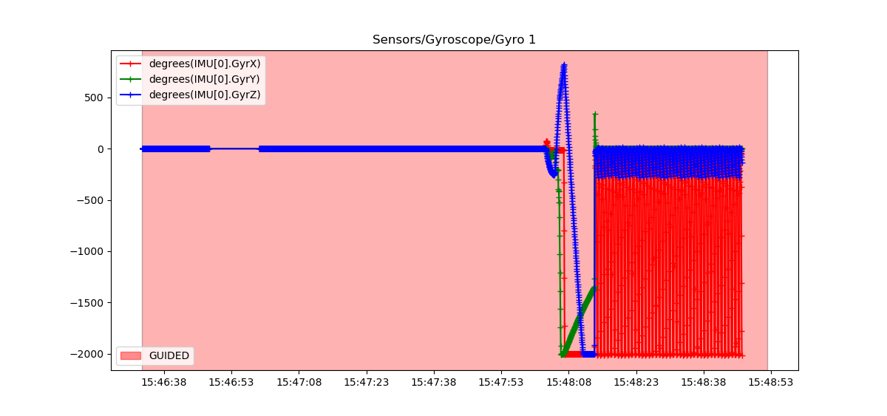
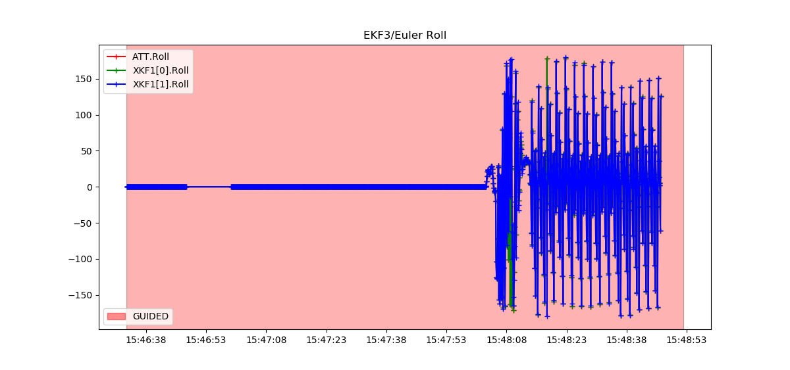
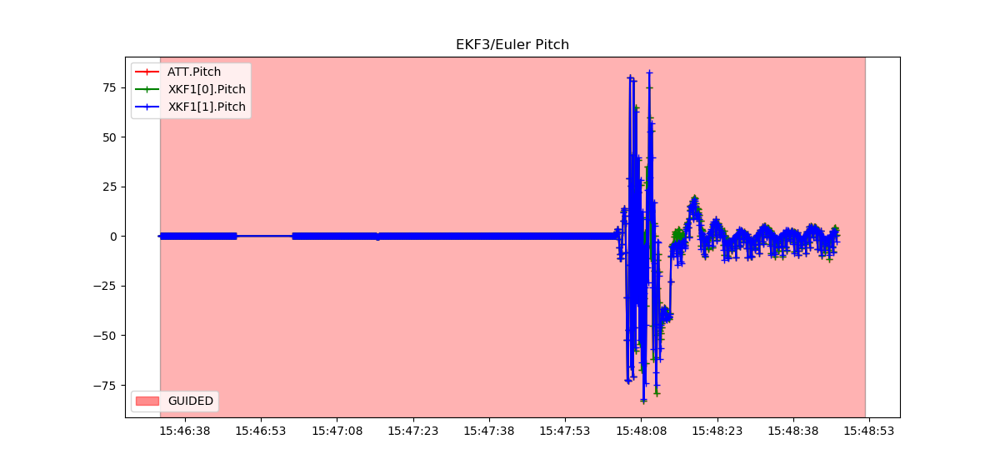
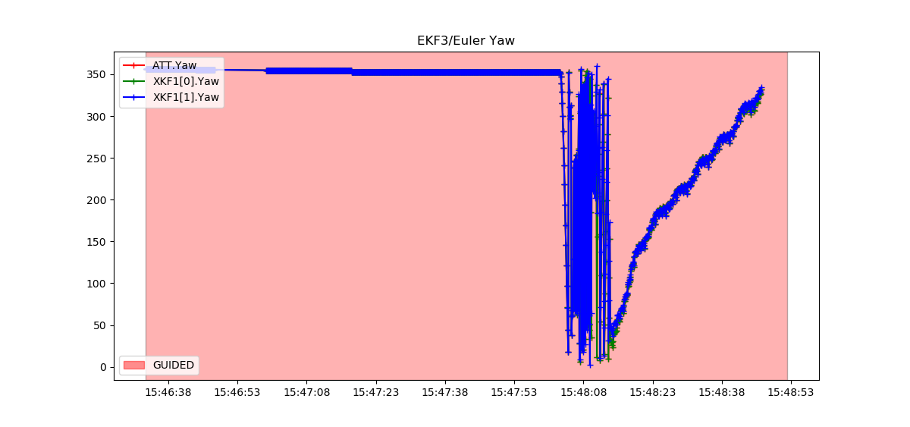
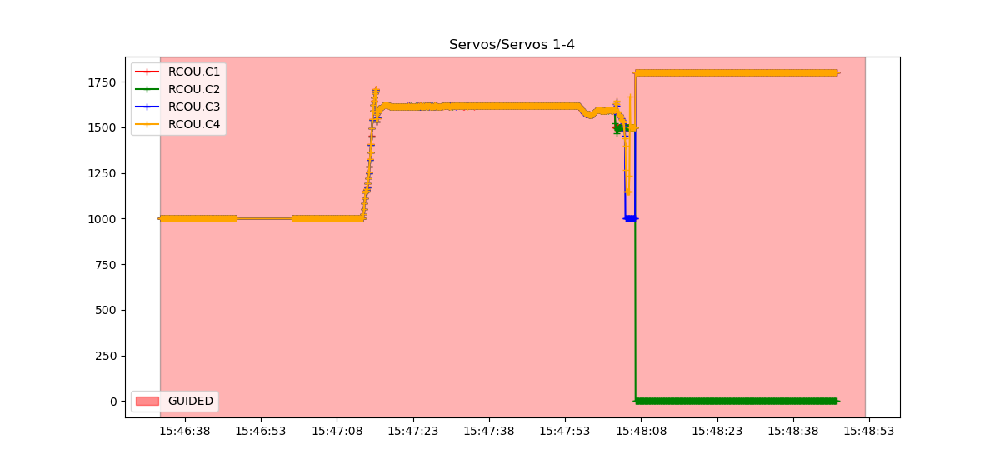

# motor_fault_sim_dataset

| Vehicle Type | Frame | Frame Type | Filename
| ----------- | ----------- | ----------- | ----------- |
| Quadcopter |  | Plus | M1 [bin](dist/quad-plus/m1.bin) [mat](dist/quad-plus/m1.mat)   M2 [bin](dist/quad-plus/m2.bin) [mat](dist/quad-plus/m2.mat)  M3 [bin](dist/quad-plus/m3.bin) [mat](dist/quad-plus/m3.mat)  M4 [bin](dist/quad-plus/m4.bin) [mat](dist/quad-plus/m4.mat)  M1 & M2 [bin](dist/quad-plus/m1m2.bin) [mat](dist/quad-plus/m1m2.mat)  M1 & M3 [bin](dist/quad-plus/m1m3.bin) [mat](dist/quad-plus/m1m3.mat)  M1 & M4 [bin](dist/quad-plus/m1m4.bin) [mat](dist/quad-plus/m1m4.mat)  M2 & M3 [bin](dist/quad-plus/m2m3.bin) [mat](dist/quad-plus/m2m3.mat)  M2 & M4 [bin](dist/quad-plus/m2m4.bin) [mat](dist/quad-plus/m2m4.mat)  M3 & M4 [bin](dist/quad-plus/m3m4.bin) [mat](dist/quad-plus/m3m4.mat)
| Quadcopter |  | X | M1 [bin](dist/quad-x/m1.bin) [mat](dist/quad-x/m1.mat)   M2 [bin](dist/quad-x/m2.bin) [mat](dist/quad-x/m2.mat)  M3 [bin](dist/quad-x/m3.bin) [mat](dist/quad-x/m3.mat)  M4 [bin](dist/quad-x/m4.bin) [mat](dist/quad-x/m4.mat)  M1 & M2 [bin](dist/quad-x/m1m2.bin) [mat](dist/quad-x/m1m2.mat)  M1 & M3 [bin](dist/quad-x/m1m3.bin) [mat](dist/quad-x/m1m3.mat)  M1 & M4 [bin](dist/quad-x/m1m4.bin) [mat](dist/quad-x/m1m4.mat)  M2 & M3 [bin](dist/quad-x/m2m3.bin) [mat](dist/quad-x/m2m3.mat)  M2 & M4 [bin](dist/quad-x/m2m4.bin) [mat](dist/quad-x/m2m4.mat)  M3 & M4 [bin](dist/quad-x/m3m4.bin) [mat](dist/quad-x/m3m4.mat)
| Hexacopter |  | Plus | M1 [bin](dist/hexa-plus/m1.bin) [mat](dist/hexa-plus/m1.mat)  M2 [bin](dist/hexa-plus/m2.bin) [mat](dist/hexa-plus/m2.mat)  M3 [bin](dist/hexa-plus/m3.bin) [mat](dist/hexa-plus/m3.mat)  M4 [bin](dist/hexa-plus/m4.bin) [mat](dist/hexa-plus/m4.mat)  M5 [bin](dist/hexa-plus/m5.bin) [mat](dist/hexa-plus/m5.mat)  M6 [bin](dist/hexa-plus/m6.bin) [mat](dist/hexa-plus/m6.mat)  M1 & M2 [bin](dist/hexa-plus/m1m2.bin) [mat](dist/hexa-plus/m1m2.mat)  M1 & M3 [bin](dist/hexa-plus/m1m3.bin) [mat](dist/hexa-plus/m1m3.mat)  M1 & M4 [bin](dist/hexa-plus/m1m4.bin) [mat](dist/hexa-plus/m1m4.mat)  M1 & M5 [bin](dist/hexa-plus/m1m5.bin) [mat](dist/hexa-plus/m1m5.mat)  M1 & M6 [bin](dist/hexa-plus/m1m6.bin) [mat](dist/hexa-plus/m1m6.mat)  M2 & M3 [bin](dist/hexa-plus/m2m3.bin) [mat](dist/hexa-plus/m2m3.mat)  M2 & M4 [bin](dist/hexa-plus/m2m4.bin) [mat](dist/hexa-plus/m2m4.mat)  M2 & M5 [bin](dist/hexa-plus/m2m5.bin) [mat](dist/hexa-plus/m2m5.mat)  M2 & M6 [bin](dist/hexa-plus/m2m6.bin) [mat](dist/hexa-plus/m2m6.mat)  M3 & M4 [bin](dist/hexa-plus/m3m4.bin) [mat](dist/hexa-plus/m3m4.mat)  M3 & M5 [bin](dist/hexa-plus/m3m5.bin) [mat](dist/hexa-plus/m3m5.mat)  M3 & M6 [bin](dist/hexa-plus/m3m6.bin) [mat](dist/hexa-plus/m3m6.mat)  M4 & M5 [bin](dist/hexa-plus/m4m5.bin) [mat](dist/hexa-plus/m4m5.mat)  M4 & M6 [bin](dist/hexa-plus/m4m6.bin) [mat](dist/hexa-plus/m4m6.mat)  M5 & M6 [bin](dist/hexa-plus/m5m6.bin) [mat](dist/hexa-plus/m5m6.mat)
| Hexacopter |  | X | M1 [bin](dist/hexa-x/m1.bin) [mat](dist/hexa-x/m1.mat)  M2 [bin](dist/hexa-x/m2.bin) [mat](dist/hexa-x/m2.mat)  M3 [bin](dist/hexa-x/m3.bin) [mat](dist/hexa-x/m3.mat)  M4 [bin](dist/hexa-x/m4.bin) [mat](dist/hexa-x/m4.mat)  M5 [bin](dist/hexa-x/m5.bin) [mat](dist/hexa-x/m5.mat)  M6 [bin](dist/hexa-x/m6.bin) [mat](dist/hexa-x/m6.mat)  M1 & M2 [bin](dist/hexa-x/m1m2.bin) [mat](dist/hexa-x/m1m2.mat)  M1 & M3 [bin](dist/hexa-x/m1m3.bin) [mat](dist/hexa-x/m1m3.mat)  M1 & M4 [bin](dist/hexa-x/m1m4.bin) [mat](dist/hexa-x/m1m4.mat)  M1 & M5 [bin](dist/hexa-x/m1m5.bin) [mat](dist/hexa-x/m1m5.mat)  M1 & M6 [bin](dist/hexa-x/m1m6.bin) [mat](dist/hexa-x/m1m6.mat)  M2 & M3 [bin](dist/hexa-x/m2m3.bin) [mat](dist/hexa-x/m2m3.mat)  M2 & M4 [bin](dist/hexa-x/m2m4.bin) [mat](dist/hexa-x/m2m4.mat)  M2 & M5 [bin](dist/hexa-x/m2m5.bin) [mat](dist/hexa-x/m2m5.mat)  M2 & M6 [bin](dist/hexa-x/m2m6.bin) [mat](dist/hexa-x/m2m6.mat)  M3 & M4 [bin](dist/hexa-x/m3m4.bin) [mat](dist/hexa-x/m3m4.mat)  M3 & M5 [bin](dist/hexa-x/m3m5.bin) [mat](dist/hexa-x/m3m5.mat)  M3 & M6 [bin](dist/hexa-x/m3m6.bin) [mat](dist/hexa-x/m3m6.mat)  M4 & M5 [bin](dist/hexa-x/m4m5.bin) [mat](dist/hexa-x/m4m5.mat)  M4 & M6 [bin](dist/hexa-x/m4m6.bin) [mat](dist/hexa-x/m4m6.mat)  M5 & M6 [bin](dist/hexa-x/m5m6.bin) [mat](dist/hexa-x/m5m6.mat)

## Sample data

- X-Frame QuadCopter is used
- [15:47:15] Drone starts ascent
- [15:47:55] Goes up to altitude of 100meters
- [15:48:00] Fault introduced in motor 2 (from code)
- Immediately starts descent
- [15:48:15] Crash lands in 15-16 seconds

### Barometer

### Gyroscope

### Roll, Pitch, Yaw

### Servo outputs
